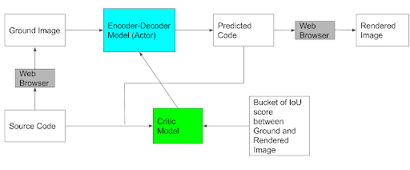
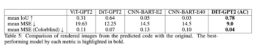
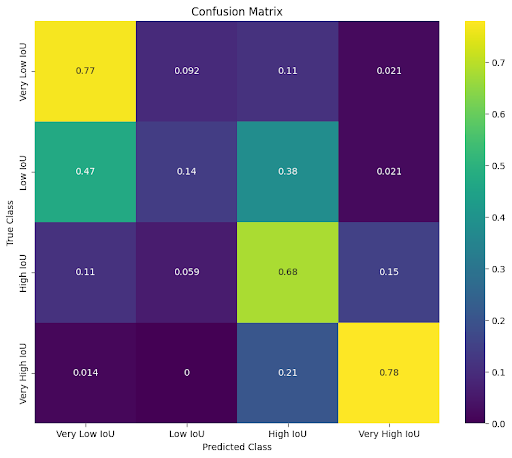
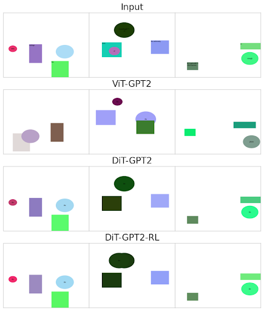

# Learning-to-Generate-Code-from-Images-with-Actor-Critic

This project explores generating HTML code from input images using actor-critic reinforcement learning. The goal is to reproduce the visual structure and styling of images as functional HTML code.

## Approach 

- Fine-tuned DiT (Document Image Transformer) + GPT2 model using actor-critic reinforcement learning
- Actor model generates HTML code given an input image
- Critic model estimates similarity between generated and ground truth code
- Actor trained to maximize rewards from critic's similarity estimates  
- Custom htmlBLEU metric compares HTML DOM structure, CSS attributes between outputs

## Model Architecture

 
  

## Synthetic Dataset

- 25,000 training samples of image + HTML code pairs 
- Synthetic samples of shapes, colors, layouts
- 3,000 test samples

## Results

- Actor-critic model outperforms CNN, ViT, and DiT baselines on htmlBLEU
- Achieved mean htmlBLEU score of 0.78 compared to 0.31 for ViT and 0.64 for DiT
- Robust performance even as sample complexity increases

 
  

## Confusion Matrix

 
  

## Sample Visual Comparison

Input Image | Ground Truth Code | Generated Code
--- | --- | ---

 
  

## References

[Full Project Report](CMSC828A_Project_Report.pdf)
